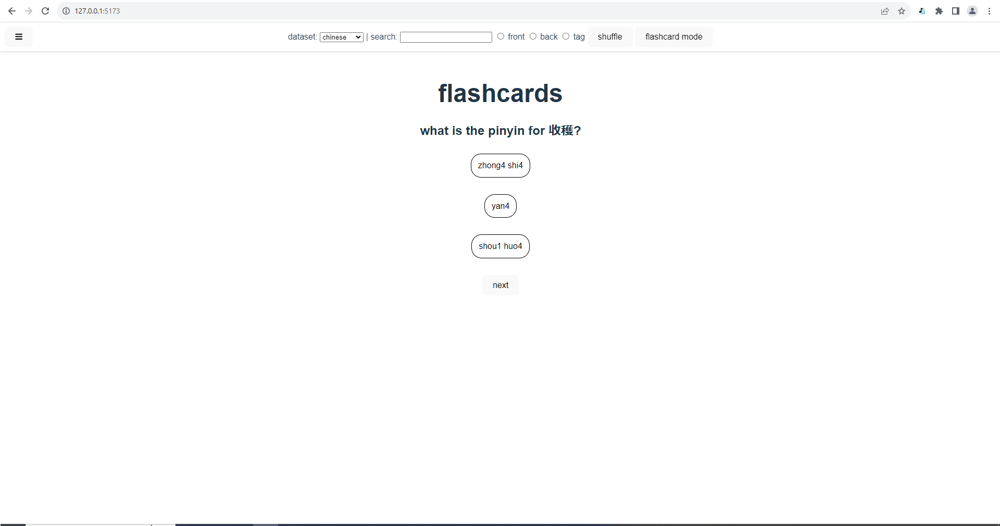

# flashcards    
with Svelte, TypeScript and Vite    
    
    
    
    
    
for the chinese flashcard option, I added character recognition functionality with the intent to help make it easier to search the cards for a certain character. however, the accuracy can vary and it may be buggy so it might not be super useful at the moment.    
    
Thanks very much to gugray's https://github.com/gugray/hanzi_lookup, which I used for this functionality.    
    
    